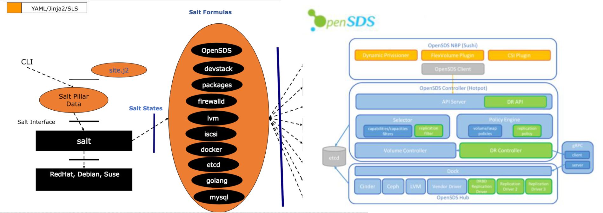

# Deploying soda with Salt

Deploy soda (www.soda.io) using Salt. This is an experimental solution using repeatable patterns of jinja/yaml to deploy cloud-native stack using infrastructure as code.

Software versions
=================
Verified on CENTOS-7, UBUNTU-18, and OPENSUSE-15 with Salt 2018.3 and 2019.2 releases.

Solution View
=============

<a href="https://github.com/soda/soda"></a>

Reference Vagrant setup
=======================
Refer to HACKING.md. Prefer a minimum of 6GB+4CPU per virutalized hosts.


Procedure
===========
Deploy soda using the steps below. The expected installer duration is 20-55 minutes depending on your network bandwith and compute resources (we recommend at least 4CPU x 8G ram x 60G rootdisk).

Install Salt on UBUNTU/CENTOS/OpenSUSE_15
```
curl -o salter.sh https://raw.githubusercontent.com/soda/soda-installer/master/salt/salter.sh && sudo bash salter.sh -i bootstrap && sudo bash salter.sh -i salter
```
Reboot if kernel got major-upgraded. If in doubt, reboot anyway.
```
init 6
```

Review site deployment data to double check ipv4 adddres. Set "auth_strategy: noauth" if not using keystone.
```
 ip addr
 sudo vi /srv/salt/soda/site.j2
```

Deploy soda on UBUNTU/CENTOS/OpenSUSE_15
```
sudo bash salter.sh -i soda
```

How to test soda cluster
===========================
Check soda services are running (check logs/status if necessary)
```
 sudo -s
 docker ps -a
 ps -ef | grep osds
 systemctl list-unit-files | grep soda
```
Check soda services which start slowly first time:
```
 journalctl -u soda-multi-cloud --follow
 journalctl -u soda-cinder --follow
```

Firstly configure soda CLI tool:
```
 export soda_AUTH_STRATEGY=noauth
 export soda_ENDPOINT=http://127.0.0.1:50040   (or your <primary_host_ip)
```
Check if the pool resource is available
```
 osdsctl pool list
```

Then create a default profile:
```
 osdsctl profile create '{"name": "default", "description": "default policy", "storageType": "block"}'
```

Create a volume:
```
 osdsctl volume create 1 --name=test-001
```

List all volumes:
```
 osdsctl volume list
```

Delete the volume:
```
 osdsctl volume delete <your_volume_id>
```

### Dashboard
The soda dashboard is available at http://127.0.0.1:8088 or http://<primary_host_ip>:8088. 

Please login to the dashboard using the default admin credentials: admin/soda@123. Create tenant, user, and profiles as admin. Multi-Cloud is also supported by dashboard.

Now logout from dashboard (as admin) and login the dashboard again as a non-admin user to create volume, snapshot, expand volume, create volume from snapshot, create volume group.


How to purge and clean soda cluster
========================================
```
 sudo /srv/salt/soda/salter.sh -r soda
 sudo /srv/salt/soda/salter.sh -r devstack # optional
```
